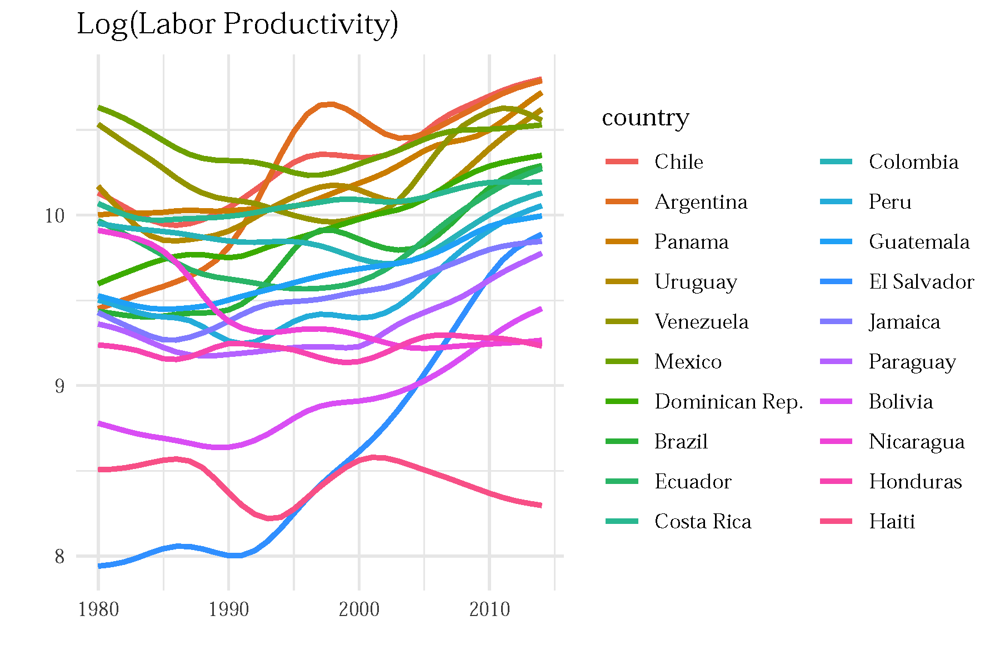
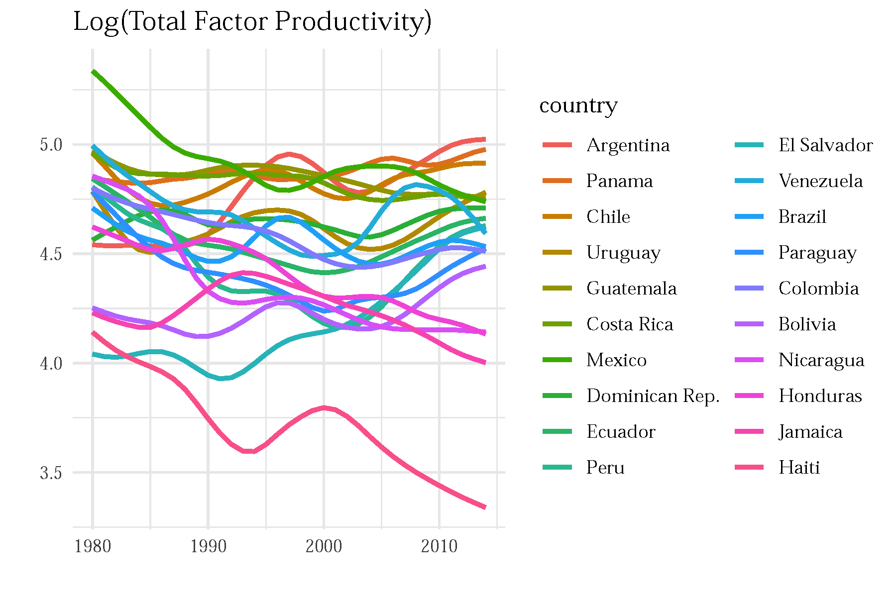
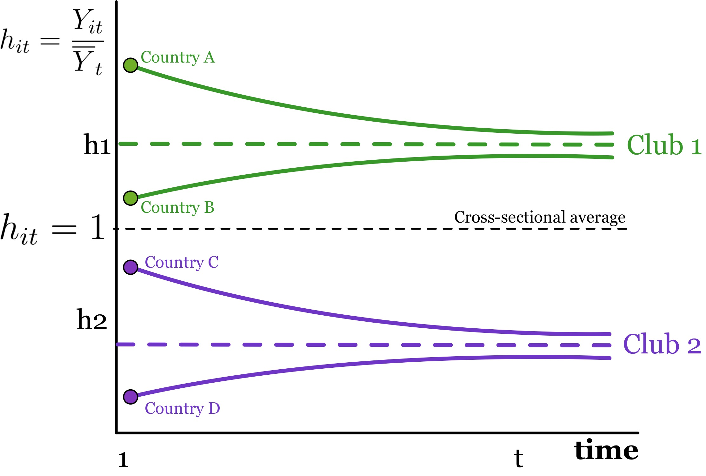
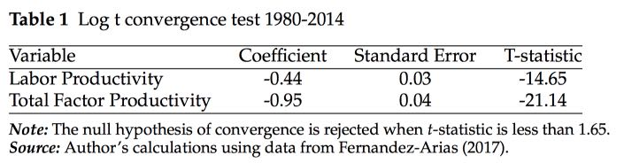
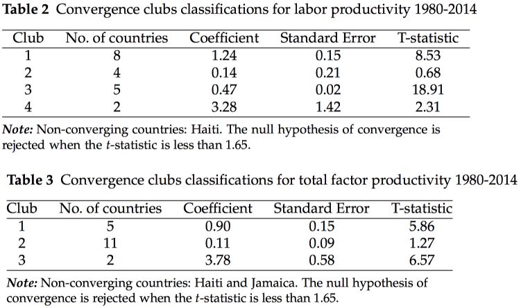
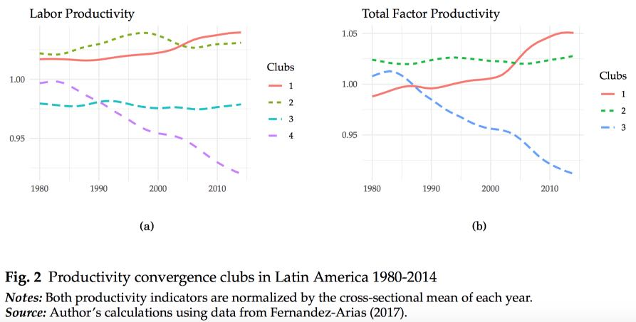
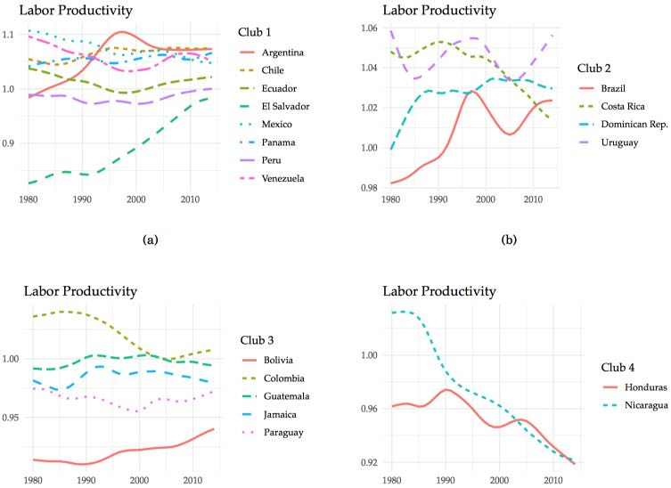
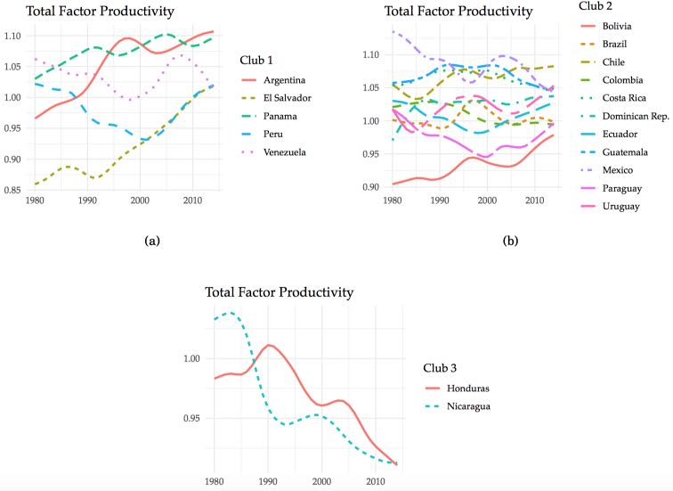

```{r setup, include=FALSE}
options(htmltools.dir.version = FALSE)
```


## Motivation:

- Economic convergence is important for regional cohesion and competitiveness

- Inconclusive literature about Latin America: Convergence vs Divergence vs Convergence Clubs (Galvao and Reis-Gomes, 2007; Barrios et. al, 2018; Martin and Vazquez, 2015)

- Development potential of Latin America constrained  by low productivity (Daude and Fernndez-Arias, 2010; Pages 2010; Restuccia, 2013)

  
## Research Objective:
  
- (Re)evaluate the convergence hypothesis across economies in Latin America with particular emphasis on productivity differences and the formation of multiple convergence clubs. 

  
## Methods:

- Nonlinear dynamic factor model  (Phillips and Sul, 2007, 2009)
- Clustering algorithm for panel data (Phillips and Sul, 2007, 2009)

## Data:

- Labor productivity and total factor productivity (Fernandez-Arias, 2017)
- 20 Latin American countries over the 1980-2014 period 


---

class: middle

## Main Results:

1. **Lack of overall(global) convergence** in both labor productivity and total factor productivity

2. **Multiple local convergence clubs:** above and below the average

3. **Convergence clubs characteristics:** 

  - Labor productivity: **Four clubs** of countries
  - Total factor productivity: **Three clubs** of countries
  - Clubs show non-parallel trends: crossings, limited stability, and separating trends
  - The lowest-productivity club (Honduras and Nicaragua) is diverging from the rest **at the highest speed**.


---

class: middle

# Outline of this presentation

1. Some stylized facts

  - Productivity across countries and over time
  - Heterogeneity across countries and over time

2. Convergence framework

  - Global convergengence test (intuition)
  - Local convergengence clubs (intuition)

3. Main results of the paper

  - Lack of overall convergence
  - Multiple convergence clubs above and bellow the average
  - Convergence clubs characteristics


<br />
<br />
[ Slides and paper available at: http://bit.ly/jasid2019n ]

---

class: center, middle

# (1) Some stylized facts
**Productivity heterogeneity across Latin America**

Labor productivity

Total factor productivity


---

class: middle,center

## Large and heterogeneous productivity differences across Latin America



Note: Labor productivity is computed as the long-run trend of (log) GDP per worker. The Hodrick-Prescott filter with a smoothing parameter of 6.25 is applied to obtain the long-run trends. 


---

class: middle,center

## Large and heterogeneous productivity differences across Latin America



Note: Total factor productivity is computed by dividing GDP per worker by an aggregate index of physical capital and human capital. The Hodrick-Prescott filter with a smoothing parameter of 6.25 is applied to obtain the long-run trends. 


---

class: middle,center

## Are there any signs of overall convergence/divergence or convergence clubs?


---

class: center, middle

# (2) Convergence framework

Global convergence test (intuition)

Local convergence clubs (intuition)


---
class: middle

# Convergence framework (brief overview)

- First, define a relative transition parameter, $h_{it}$, as

$$h_{it}=\frac{y_{it}}{\frac{1}{N}\sum_{i=1}^{N}y_{it}}$$

- Second, the convergence hypothesis is defined as

$$H_{t}=\frac{1}{N}\sum_{i=1}^{N}\left(h_{it}-1\right)^{2}\rightarrow 0$$

In other words, when the relative transition parameter converges to unity, $h_{it}\rightarrow1$, the cross-sectional variance converges to zero, $H_{t}\rightarrow0$.


- Thrid, Phillips and Sul (2007) test this hypothesis by using the following log t regression model

$$log\left(\frac{H_{1}}{H_{t}} \right)-2log\left\{ log\left(t\right)\right\}  =  a+b\:log\left(t\right)+\epsilon_{t}$$

---
class: middle, center

# Convergence test (intuition)


---
class: middle, center

# Convergence clubs (intuition)




---
class: middle, center

# (3) Main results

Lack of overall convergence

Multiple convergence clubs above and below the average

Convergence clubs characteristics

---
class: middle, center

## Lack of overall convergence




---
class: middle, center

## Multiple convergence clubs 




---
class: middle, center

## Multiple convergence clubs: Above and below the average




---
class: middle, center

## Convergence clubs characteristics: Labor productivity




---
class: middle, center

## Convergence clubs characteristics: Total factor productivity




---

class: middle

# Concluding Remarks


- Reject the (overall) convergence hypothesis both in terms of labor productivity and total factor productivity

- Multiple convergence clubs below and above the mean

- The clubs show different convergence speeds and separating tendencies.
  -The poor economic performance of Honduras and Nicaragua is driving the separation of clubs over time.

## Implications and further research

- Convergence clubs may help us identify economies facing similar challenges
- Call for better coordination and cooperation policies both within and between clubs
  -  International technology transfer initiatives to improve economic cohesion and competitiveness in Latin America.
  
- Masked behind the low productivity of Latin America, there is still a high degree of heterogeneity that is worth exploring
  - Next extension: (Re)evaluate the composition of convergence clubs using subnational data, which is to be constructed using satellite nightlight data.


---

class: center, middle

# Thank you very much for your attention

https://carlos-mendez.rbind.io

Slides and working paper available at: http://bit.ly/jasid2019n 


**Quantitative Regional and Computational Science lab**

https://quarcs-lab.rbind.io

***

This research project was supported by JSPS KAKENHI Grant Number 	19K13669 

