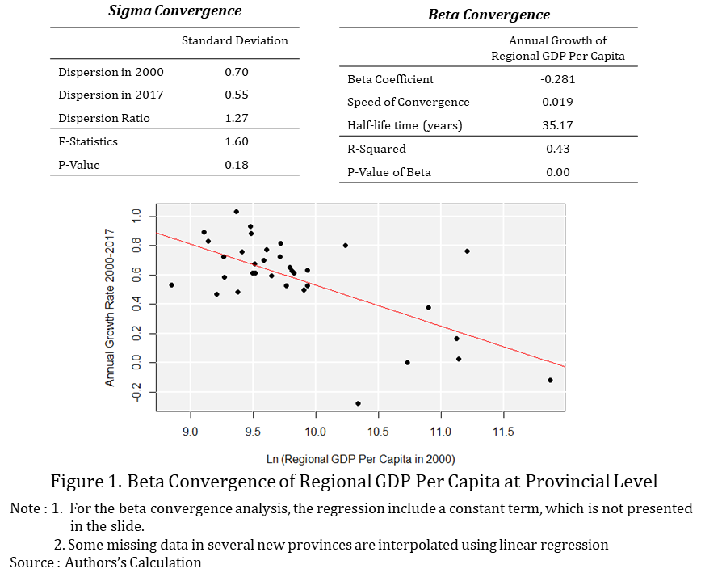
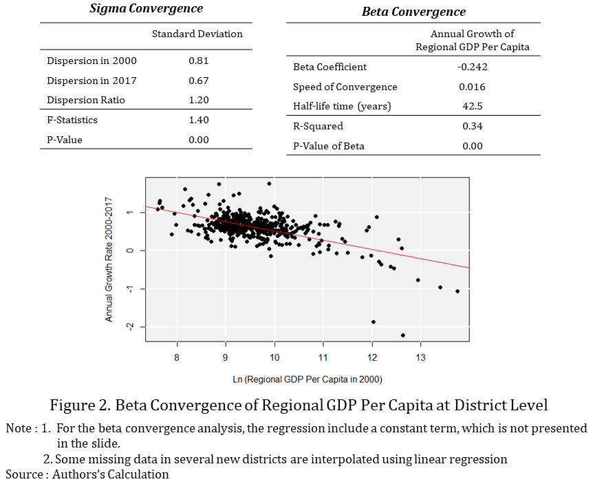
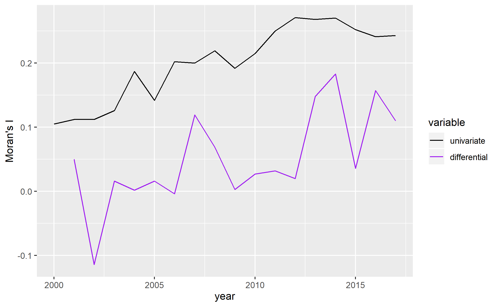
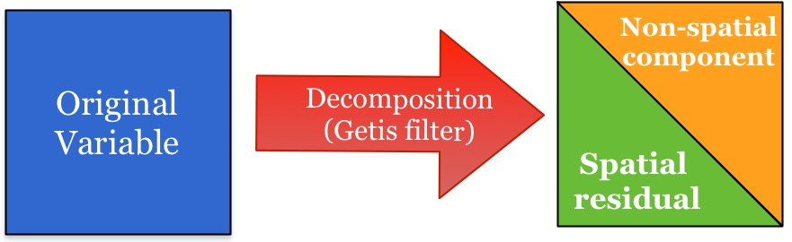
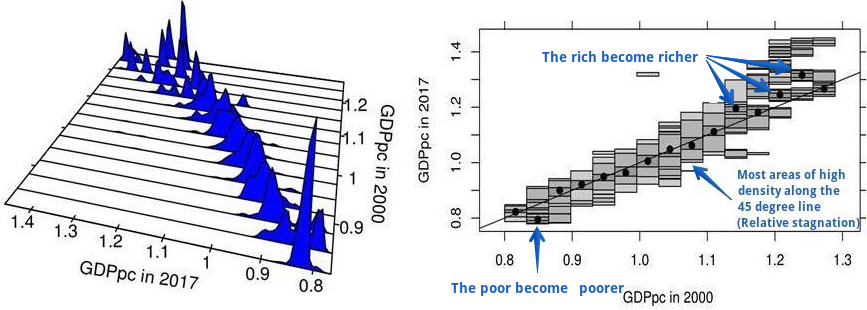
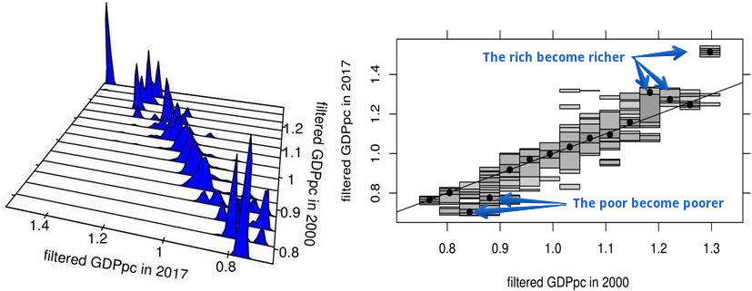

```{r setup, include=FALSE}
options(htmltools.dir.version = FALSE)
```

## Motivation:

- Large regional differences in income per capita despite several policy efforts (Akita 1988; Garcia and Soelistianingsih 1998; Kataoka 2012)

- Spatial effects play a small role in provincial convergence in Indonesia (Vidyattama 2013, 2014)

## Research Objective:
  
- Study the spatio-temporal dynamics of income per capita accross  Indonesian regions using **_a novel district-level dataset_** constructed for the 2000-2017 period

## Methods:

- Classical convergence (Barro and Sala-i-Martin 1992)

- Distributional convergence (Quah 1996; Hyndman et. al 1996)

- Spatial autocorrelation (Moran 1948, Anselin et. al 2006)

- Spatial decomposition (Getis 1995; Fischer and Stumpner 2010)

## Data:

- 514 districts (34 provinces) over the 2000-2017 period.


---

class: middle

## Main Results:

1. **_On average_,** convergence at the provincial and district levels

2. **_Beyond the average_,** lack of distributional convergence
    - Mostly relative stagnation with some signs of divergence at the tails

3. **Significant and increasing spatial autocorrelation:** ONLY at the district level 

4. **Spatial effects play a role in the distribution dynamics** 
    - Spatial dependece helps reduce extreme disparities
    
      - It helps avoid further income polarization
  


---

class: middle

# Outline of this presentation

1. **Some Stylized Facts **

  - **_On average_,** convergence at the provincial and district levels
  -  **Significant and increasing spatial autocorrelation:** ONLY at the district level

2. **Distributional convergence and spatial decomposition frameworks** 

  - Distributional convergence framework (intuition)
  - Spatial decomposition framework (intution)
    
3. **Main Results:**

  - **_Beyond the average_,** lack of distributional convergence

  - **Spatial dependece helps reduce extreme disparities** 
    
    
---
class: center, middle

# (1) Some Stylized Facts

  **_On average_,** convergence at the provincial and district levels
  
  **Significant and increasing spatial autocorrelation:** ONLY at the district level
  
---

class: center, middle

## On average,  is there convergence at the provincial level?



---

class: center, middle

## On average, is there convergence at the district level?



---
class: center, middle

## Is spatial dependency _at the district level_ statistically significant? 


$$I = \frac{\sum_i\sum_j w_{ij} z_i.z_j}{\sum_i z_i^2} = \frac{\sum_i (z_i \times \sum_j w_{ij} z_j)}{\sum_i z_i^2}.$$




Yes, moreover it is increasing over time.

---
class: center, middle

# How do we compute the spatial weights matrix?

We want to avoid the use of an arbitrary distance band.

Original feature: We use the locations of capital cities to estimate Thiessen polygons and recover a contiguity matrix. 


---

class: center, middle

# (2) Distributional convergence

Let's study convergence BEYOND the average


---
class: middle, center

# The distribution dynamics framework


---
class: middle, center

# Some illustrative patterns of stagnation, convergence, and divergence


---
class: center, middle

# Spatial decomposition framework: The Getis filter

$$x_i^* = \frac{xi(W_i)}{(n-1)G_i(d_m)}$$



---

class: center, middle

# (3) Main Results

  (1) **_Beyond the average_,** lack of distributional convergence

  (2) **Spatial dependece helps reduce extreme disparities** 


---

class: middle, center

# Beyond the average, lack of distributional convergence

## Mostly relative stagnation and divergence at the extremes




---
class: middle, center

# Beyond the average, lack of distributional convergence (further polarization)

## Distribution dynamics of the non-spatial component



---

#Concluding Remarks

## Classical convergence VS Distributional convergence

- Classical: On average, convergence
- Distributional: Beyond the average, lack of convergence 

## On the role of space
- Increasing spatial autocorrelation
- Geographic neighbors helped reduce some extreme disparities  

## Implications 

- Beyond the average progress, regional inequality is still an issue 
- For further research : 
  - Using district-level data, what is the role of geographical neighbors in accelerating  the speed of convergence?
  - Using the time series of the district-level data, are there convergence clubs?
  - Integration of spatial and dynamic clusters 


---

class: center, middle

# Thank you very much for your attention

Slides, working paper, data, and code of related to this presentation are available at:

https://quarcs-lab.rbind.io

 

**Quantitative Regional and Computational Science Lab**


